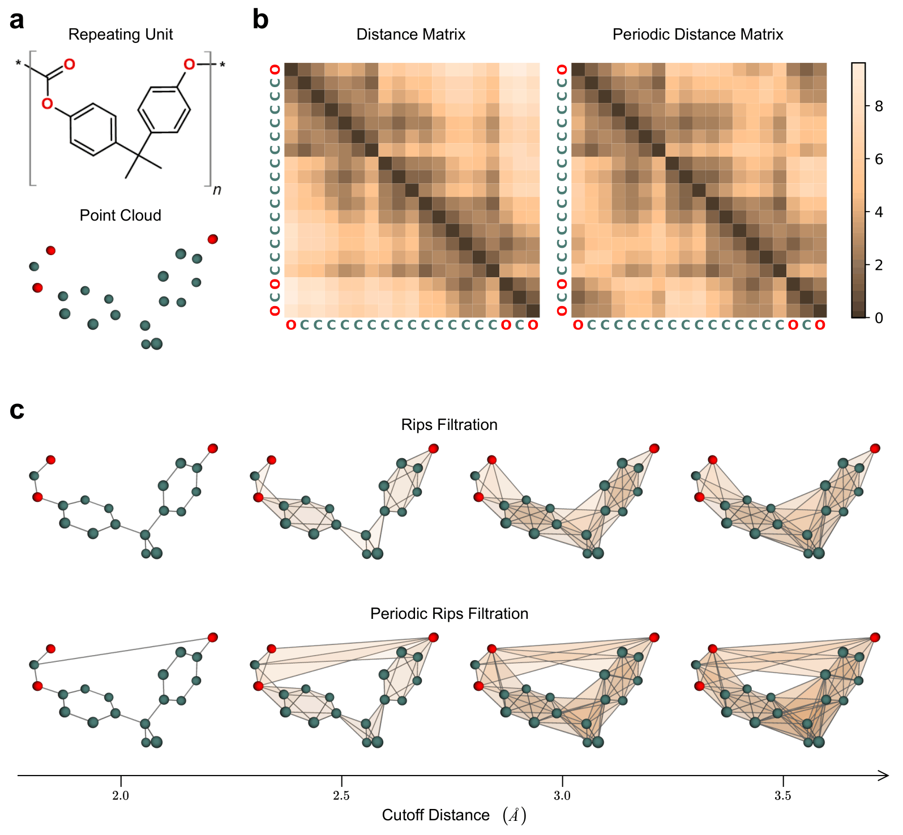

# Periodic-TDL

Code and data release for **Periodic Topological Deep Learning for Polymer
Design and Discovery**.

Periodic-TDL converts polymer pSMILES into periodic geometric representations,
constructs periodic Vietoris-Rips filtrations over the repeat unit, and learns
polymer representations with a Hierarchical Simplicial Message Passing (HSMP)
encoder. The workflow is designed to retain covalent structure, periodic
through-boundary proximity, multiscale topology, and higher-order simplex
interactions before downstream property prediction.



## What Is Included

```text
code/       HSMP model, preprocessing scripts, pretraining, fine-tuning, and inference
data/       cleaned pretraining/fine-tuning data and acrylate Tg prediction tables
figures/    README figures for the repository, model, and data summaries
```

The main code workflow lives in [`code/`](code/README.md). It covers periodic
geometry construction, heterogeneous graph generation, self-supervised
pretraining, downstream fine-tuning, checkpoint use, and Tg inference.

The released datasets are documented in [`data/`](data/README.md). They include:

- a one-million-scale unlabeled pretraining set,
- nine cleaned downstream polymer property datasets with cross-validation folds,
- a generated 48,208-polymer acrylate/acrylamide library with Tg predictions,
  and
- a 22-polymer literature acrylate/acrylamide comparison set with Tg predictions.

## Model Summary

Periodic-TDL starts from a polymer repeat unit and builds a periodic distance
matrix that accounts for neighboring repeat units under periodic boundary
conditions. Rips complexes at multiple cutoffs are then packed as PyTorch
Geometric `HeteroData` graphs. HSMP performs message passing within each
filtration level and cross-scale refinement from coarser to finer cutoffs, so
atom-scale representations can incorporate long-range and higher-order
topological context.

The released workflow supports two main paths:

1. use pretrained HSMP/checkpoint bundles for downstream fine-tuning or Tg
   inference, and
2. rebuild the periodic complexes and pretrain HSMP from scratch.

Large model checkpoints are not committed to Git. Download links and placement
instructions are provided in [`code/README.md`](code/README.md#checkpoints).

