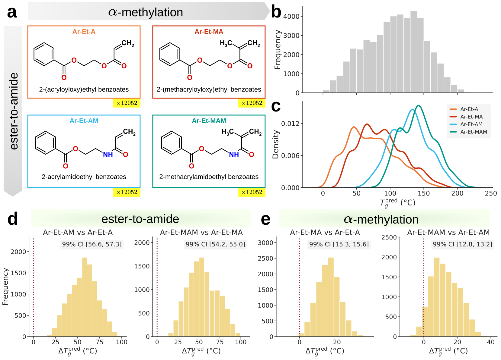

# Data

This folder contains the cleaned input data used by Periodic-TDL and the
acrylate/acrylamide Tg prediction tables released with the repository.



## Layout

```text
data/
|-- processed/   cleaned model-ready CSV files and downstream split files
|-- acrylate/    generated and literature acrylate/acrylamide Tg predictions
```

## Processed Data

`processed/` contains model-ready CSV files consumed by the scripts in
[`../code`](../code/README.md). CSV files use pSMILES strings with polymer
connection points marked by `*`.

| File | Rows | Columns | Purpose |
| --- | ---: | --- | --- |
| `pretrain_1M_cleaned.csv` | 995,799 | `smiles` | unlabeled polymers for HSMP pretraining |
| `acrylate_v3_cleaned.csv` | 48,208 | `smiles` | generated acrylate/acrylamide library for Tg inference |

Downstream fine-tuning datasets use `smiles,value` CSV files plus matching
`<dataset>_folds.pkl` split files. Each split file is a pickled list of fold
dictionaries with row indices under `train` and `test`.

| Dataset | Rows | Property | Unit | Notes |
| --- | ---: | --- | --- | --- |
| `Tg` | 8,066 | glass transition temperature | deg C | experimental |
| `Egc` | 4,125 | bandgap, chain | eV | DFT-derived |
| `Eib` | 1,744 | electron injection barrier | eV | DFT-derived |
| `Egb` | 561 | bandgap, bulk | eV | DFT-derived |
| `Eea` | 368 | electron affinity | eV | DFT-derived |
| `Ei` | 370 | ionization energy | eV | DFT-derived |
| `EPS` | 382 | dielectric constant | dimensionless | DFT-derived |
| `Nc` | 382 | refractive index | dimensionless | DFT-derived |
| `Xc` | 432 | crystallization tendency | percent | DFT-derived |

## Acrylate Data

`acrylate/acrylate_v3.csv` contains 48,208 generated acrylate/acrylamide
polymers and their Tg predictions. The table includes:

- `pSMILES`,
- `Tg_pred_variant_0` through `Tg_pred_variant_9`, and
- `Tg_pred_mean`, `Tg_pred_std`.

The ten Tg variants correspond to the ten deployment models used for ensemble
inference.

`acrylate/acrylate_lit.csv` contains 22 literature polymers arranged as 11
pairs. It includes polymer metadata, measured literature Tg values where
available, final Tg values in Celsius, references, ten model predictions, and
prediction mean/std columns. Seven pairs were filtered out of the final paired
analysis because at least one polymer in the pair appeared in the training data.

## Using The Data

The code expects this folder to sit next to `code/`, with processed files at:

```text
../data/processed/
```

For a downstream dataset basename such as `Tg`, the expected files are:

```text
../data/processed/Tg_cleaned.csv
../data/processed/Tg_folds.pkl
```

Pretraining and inference-only datasets require only a `smiles` column.
Downstream fine-tuning datasets require both `smiles` and `value`.

